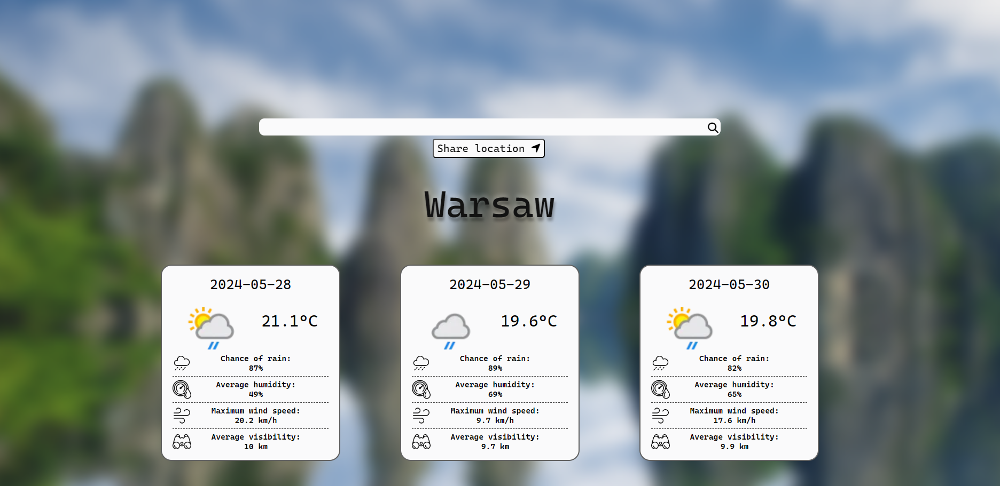

<!-- Improved compatibility of back to top link: See: https://github.com/othneildrew/Best-README-Template/pull/73 -->

<a name="readme-top"></a>

<!--
*** Thanks for checking out the Best-README-Template. If you have a suggestion
*** that would make this better, please fork the repo and create a pull request
*** or simply open an issue with the tag "enhancement".
*** Don't forget to give the project a star!
*** Thanks again! Now go create something AMAZING! :D
-->

<!-- PROJECT SHIELDS -->
<!--
*** I'm using markdown "reference style" links for readability.
*** Reference links are enclosed in brackets [ ] instead of parentheses ( ).
*** See the bottom of this document for the declaration of the reference variables
*** for contributors-url, forks-url, etc. This is an optional, concise syntax you may use.
*** https://www.markdownguide.org/basic-syntax/#reference-style-links
-->

<!-- PROJECT LOGO -->
<br />
<div align="center">
  <a href="https://github.com/github_username/repo_name">
    
  </a>

<h3 align="center">Weather-Checker</h3>

  <p align="center">
    This TypeScript-based application allows users to check the weather forecast for the next three days. Users can provide their location by entering a city name or by sharing their location through the Navigator API. The app fetches real-time weather data and presents a detailed forecast, helping users stay informed about upcoming weather conditions.
    <br />
    <br />
    <br />
    <a href="https://github.com/IgrWrz21/Weather-Checker.git">View Demo</a>
    
    
  </p>
</div>

<!-- TABLE OF CONTENTS -->
<details>
  <summary>Table of Contents</summary>
  <ol>
    <li>
      <a href="#about-the-project">About The Project</a>
      <ul>
        <li><a href="#built-with">Built With</a></li>
      </ul>
    </li>
    <li>
      <a href="#getting-started">Getting Started</a>
      <ul>
        <li><a href="#prerequisites">Prerequisites</a></li>
        <li><a href="#installation">Installation</a></li>
      </ul>
    </li>
    <li><a href="#usage">Usage</a></li>
    <li><a href="#roadmap">Roadmap</a></li>
    <li><a href="#contributing">Contributing</a></li>
    <li><a href="#license">License</a></li>
    <li><a href="#contact">Contact</a></li>
    <li><a href="#acknowledgments">Acknowledgments</a></li>
  </ol>
</details>

<!-- ABOUT THE PROJECT -->

## About The Project


<p align="right">(<a href="#readme-top">back to top</a>)</p>

### Built With

- ![HTML]
- ![CSS]
- ![JavaScript]
- ![TypeScript]
<p align="right">(<a href="#readme-top">back to top</a>)</p>

<!-- GETTING STARTED -->

## Getting Started

This is an example of how you may give instructions on setting up your project locally.
To get a local copy up and running follow these simple example steps.

### Installation

1. Clone the repo
   ```sh
   git clone https://github.com/IgrWrz21/To-do-List.git
   ```
2. Open terminal and install dependencies

```sh
   cd <project_name>
   npm install
```

2. Build and run the project

```sh
   npm start
```

<p align="right">(<a href="#readme-top">back to top</a>)</p>

<!-- USAGE EXAMPLES -->

<!-- ROADMAP -->

## Roadmap

- [x] Add additional weather information
- [x] Add geting location from user by navigator API
- [ ] Add popup with information when city wasn't found
- [ ] Add more days to display
  - [ ] Add functionality to slides those days

<p align="right">(<a href="#readme-top">back to top</a>)</p>

<!-- ACKNOWLEDGMENTS -->

<!-- MARKDOWN LINKS & IMAGES -->
<!-- https://www.markdownguide.org/basic-syntax/#reference-style-links -->

[CSS]: https://img.shields.io/badge/CSS3-grey?style=for-the-badge&logo=css3&logoColor=1572B6
[HTML]: https://img.shields.io/badge/HTML5-grey?style=for-the-badge&logo=html5
[JavaScript]: https://img.shields.io/badge/JAVASCRIPT-grey?style=for-the-badge&logo=javascript
[TypeScript]: https://img.shields.io/badge/TypeScript-grey?style=for-the-badge&logo=typescript
